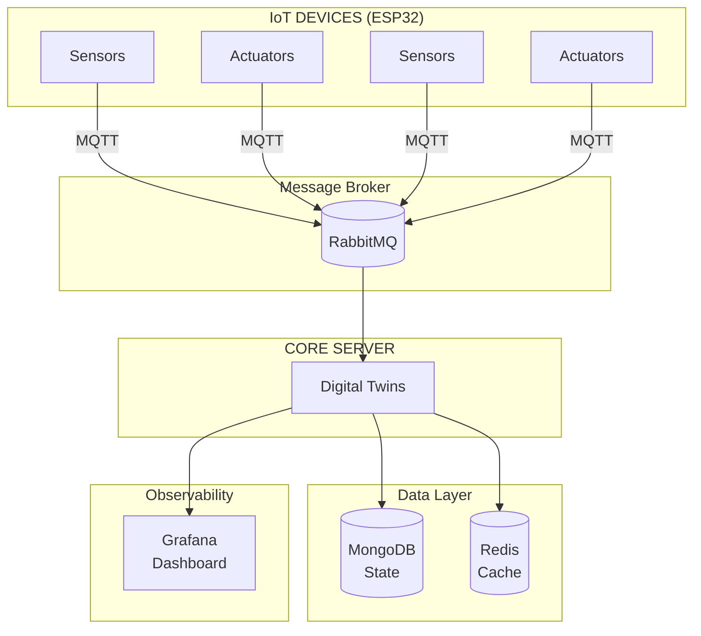

# Calcifer

An IoT platform that uses the **Digital Twin** pattern to provide centralized control, monitoring, and self-healing
capabilities for connected devices.

## Overview

Calcifer consists of three main components:

| Component          | Description                                         | Technology                       |
|--------------------|-----------------------------------------------------|----------------------------------|
| **Core Server**    | Central management system with Digital Twin pattern | Spring Boot 4.0.2, Java 25       |
| **Infrastructure** | Observability stack (metrics, logs, traces)         | Grafana, Prometheus, Loki, Tempo |
| **IoT Device**     | ESP32 firmware for sensors and actuators            | C++, PlatformIO                  |

## Architecture



## Quick Start

### Prerequisites

- Docker & Docker Compose
- Java 25 (via SDKMAN)
- Maven 3.9+

### Start Infrastructure

```bash
cd infrastructure
cp .env.example .env  # Configure secrets
docker compose up -d
```

### Start Core Server

```bash
cd core-server
./mvnw spring-boot:run -Dspring-boot.run.profiles=dev
```

### Access Services

| Service    | URL                    | Credentials          |
|------------|------------------------|----------------------|
| Grafana    | http://localhost:3000  | admin/admin          |
| RabbitMQ   | http://localhost:15672 | admin/password_admin |
| Prometheus | http://localhost:9090  | -                    |

## Documentation

Complete documentation is available in the following files:

### Core Server

| Document                                      | Description                 |
|-----------------------------------------------|-----------------------------|
| [README](core-server/README.md)               | Overview and quick start    |
| [Domain Model](core-server/DOMAIN.md)         | Entities and business rules |
| [Customization](core-server/CUSTOMIZATION.md) | Extending the system        |
| [Operations](core-server/OPERATIONS.md)       | Production deployment       |
| [ADR](core-server/ADR.md)                     | Architecture decisions      |

### Infrastructure

| Document                           | Description               |
|------------------------------------|---------------------------|
| [README](infrastructure/README.md) | Observability stack setup |

### IoT Device

| Document                                                           | Description              |
|--------------------------------------------------------------------|--------------------------|
| [README](iot-device/README.md)                                     | ESP32 firmware overview  |
| [MQTT Topics](iot-device/lib/MqttManager/MQTT_TOPICS_REFERENCE.md) | Topic patterns reference |

📄 **Full documentation index**: [DOCUMENTATION.md](DOCUMENTATION.md)

## Project Structure

```tree
calcifer/
├── core-server/          # Spring Boot backend
├── infrastructure/       # Docker Compose + observability
├── iot-device/           # ESP32 PlatformIO firmware
├── README.md             # This file
└── DOCUMENTATION.md      # Documentation index
```

## License

Copyright © 2024 Calcifer Team. All rights reserved.