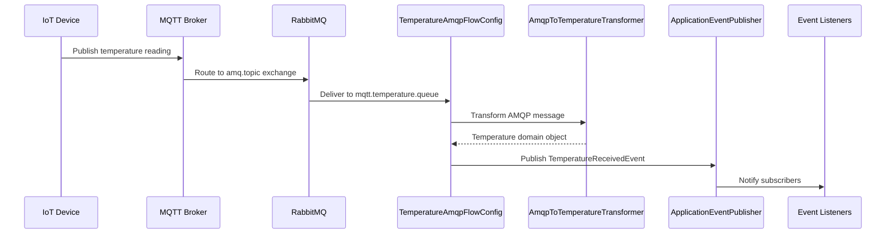
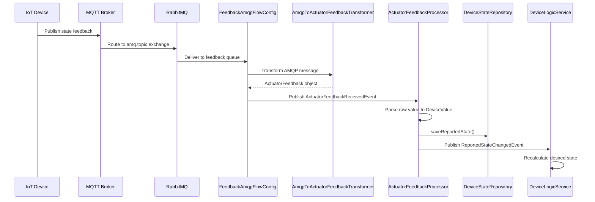
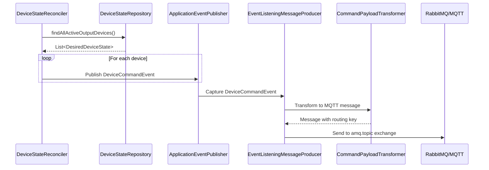
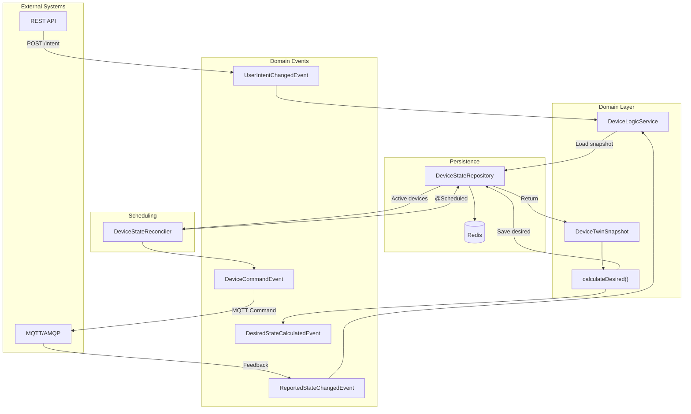
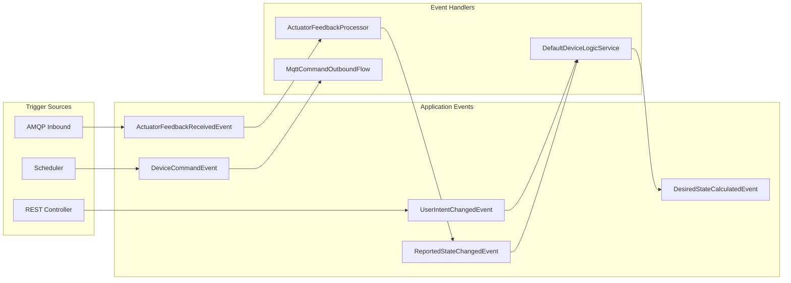

# Calcifer Core Server - Customization Guide

This document provides technical documentation for developers who want to customize or extend the Calcifer Core Server.

## Architecture Overview

Calcifer follows a **Hexagonal Architecture** (Ports and Adapters) pattern, separating the domain logic from
infrastructure concerns:

```
┌───────────────────────────────────────────────────────────────┐
│                      Infrastructure Layer                     │
│  ┌─────────────┐  ┌─────────────┐  ┌───────────────────────┐  │
│  │ REST API    │  │ AMQP/MQTT   │  │ Redis Repository      │  │
│  │ Controllers │  │ Flows       │  │ Adapter               │  │
│  └──────┬──────┘  └──────┬──────┘  └───────────┬───────────┘  │
│         │                │                     │              │
├─────────┼────────────────┼─────────────────────┼──────────────┤
│         │         Domain Layer                 │              │
│         ▼                ▼                     ▼              │
│  ┌─────────────────────────────────────────────────────────┐  │
│  │                    Ports (Interfaces)                   │  │
│  │  DeviceStateRepository    DeviceLogicService            │  │
│  └─────────────────────────────────────────────────────────┘  │
│                              │                                │
│                              ▼                                │
│  ┌─────────────────────────────────────────────────────────┐  │
│  │                    Domain Model                         │  │
│  │  UserIntent, ReportedDeviceState, DesiredDeviceState    │  │
│  │  DeviceTwinSnapshot, DeviceValue, DeviceType            │  │
│  └─────────────────────────────────────────────────────────┘  │
└───────────────────────────────────────────────────────────────┘
```

### Key Packages

| Package                             | Purpose                                    |
|-------------------------------------|--------------------------------------------|
| `domain.model`                      | Domain entities, value objects, and events |
| `domain.port`                       | Port interfaces (repository, services)     |
| `domain.service`                    | Domain service implementations             |
| `infrastructure.rest`               | REST API controllers                       |
| `infrastructure.messaging.inbound`  | AMQP message receivers and transformers    |
| `infrastructure.messaging.outbound` | MQTT command publishers                    |
| `infrastructure.persistence.redis`  | Redis repository adapter                   |
| `infrastructure.scheduling`         | Scheduled tasks (Reconciler)               |

---

## Data Flow Diagrams

### Inbound Flow: Sensor Data Acquisition



**Routing Key Format:** `.<clientId>.<sensorType>.<sensorName>.temperature`

**Key Classes:**

- `TemperatureAmqpFlowConfig` - Spring Integration flow configuration
- `AmqpToTemperatureTransformer` - Converts AMQP messages to `Temperature` domain objects
- `TemperatureReceivedEvent` - Domain event for temperature readings

---

### Inbound Flow: Actuator Feedback



**Routing Key Formats:**

- FAN: `.<clientId>.fan.<componentId>.state`
- RELAY: `.<clientId>.digital_output.<componentId>.state`

**Key Classes:**

- `RelayFeedbackAmqpFlowConfig` / `FanFeedbackAmqpFlowConfig` - Flow configurations
- `AmqpToActuatorFeedbackTransformer` - Parses routing key and payload
- `ActuatorFeedbackProcessor` - Converts raw feedback to `ReportedDeviceState`

---

### Outbound Flow: Device Commands



**Key Classes:**

- `DeviceStateReconciler` - Scheduled task that triggers reconciliation
- `MqttCommandOutboundFlowConfig` - Spring Integration outbound flow
- `CommandPayloadTransformer` - Converts `DeviceCommandEvent` to MQTT messages

---

### Three-State Digital Twin Flow



---

### Event Flow Architecture



---

## Customizing Business Logic

### The DeviceLogicService Interface

The `DeviceLogicService` is the central extension point for customizing how desired states are calculated.

**Location:** `dev.dmgiangi.core.server.domain.port.DeviceLogicService`

```java
public interface DeviceLogicService {
    void recalculateDesiredState(DeviceId id);

    DesiredDeviceState calculateDesired(DeviceTwinSnapshot snapshot);
}
```

### Current Implementation: Passthrough Logic

The default `DefaultDeviceLogicService` implements simple passthrough logic where `Desired = Intent`:

```java

@Override
public DesiredDeviceState calculateDesired(DeviceTwinSnapshot snapshot) {
    final var intent = snapshot.intent();
    if (intent == null) {
        return null;
    }
    // Phase 1: Passthrough - Desired = Intent
    return new DesiredDeviceState(
            intent.id(),
            intent.type(),
            intent.value()
    );
}
```

### Custom Business Rules Example

To implement custom logic that considers both intent and reported state:

```java

@Service
public class SmartDeviceLogicService implements DeviceLogicService {

    @Override
    public DesiredDeviceState calculateDesired(DeviceTwinSnapshot snapshot) {
        final var intent = snapshot.intent();
        final var reported = snapshot.reported();

        if (intent == null) {
            return null;
        }

        // Example: Gradual fan speed transitions
        if (snapshot.type() == DeviceType.FAN && reported != null && reported.isKnown()) {
            final var targetSpeed = ((FanValue) intent.value()).speed();
            final var currentSpeed = ((FanValue) reported.value()).speed();

            // Limit speed change to 1 unit per cycle for smooth transitions (range 0-4)
            final var maxDelta = 1;
            final var newSpeed = calculateGradualSpeed(currentSpeed, targetSpeed, maxDelta);

            return new DesiredDeviceState(
                    intent.id(),
                    intent.type(),
                    new FanValue(newSpeed)
            );
        }

        // Default: passthrough
        return new DesiredDeviceState(intent.id(), intent.type(), intent.value());
    }

    private int calculateGradualSpeed(int current, int target, int maxDelta) {
        if (Math.abs(target - current) <= maxDelta) {
            return target;
        }
        return current + (target > current ? maxDelta : -maxDelta);
    }
}
```

### Safety Limits Example

```java

@Override
public DesiredDeviceState calculateDesired(DeviceTwinSnapshot snapshot) {
    final var intent = snapshot.intent();
    if (intent == null) return null;

    // Example: Enforce maximum fan speed limit
    if (snapshot.type() == DeviceType.FAN) {
        final var requestedSpeed = ((FanValue) intent.value()).speed();
        final var maxAllowedSpeed = 4; // Safety limit (max speed is 4)

        final var safeSpeed = Math.min(requestedSpeed, maxAllowedSpeed);
        return new DesiredDeviceState(
                intent.id(),
                intent.type(),
                new FanValue(safeSpeed)
        );
    }

    return new DesiredDeviceState(intent.id(), intent.type(), intent.value());
}
```

---

## Event-Driven Extension Points

### Listening to UserIntentChangedEvent

React when users submit new intents via the API:

```java

@Component
@RequiredArgsConstructor
public class IntentAuditLogger {

    @EventListener
    public void onUserIntentChanged(UserIntentChangedEvent event) {
        final var intent = event.getIntent();
        log.info("User intent changed: device={}, type={}, value={}",
                intent.id(), intent.type(), intent.value());
        // Custom logic: audit logging, notifications, etc.
    }
}
```

### Listening to ReportedStateChangedEvent

React when devices report their actual state:

```java

@Component
public class ConvergenceMonitor {

    private final DeviceStateRepository repository;

    @EventListener
    public void onReportedStateChanged(ReportedStateChangedEvent event) {
        final var reported = event.getReportedState();
        final var snapshotOpt = repository.findTwinSnapshot(reported.id());

        snapshotOpt.ifPresent(snapshot -> {
            if (snapshot.isConverged()) {
                log.info("Device {} has converged to desired state", reported.id());
            } else {
                log.warn("Device {} diverged: reported={}, desired={}",
                        reported.id(), reported.value(), snapshot.desired().value());
            }
        });
    }
}
```

### Listening to DesiredStateCalculatedEvent

React after the logic service calculates a new desired state:

```java

@Component
public class ImmediateReconciliationTrigger {

    private final ApplicationEventPublisher eventPublisher;

    @EventListener
    public void onDesiredStateCalculated(DesiredStateCalculatedEvent event) {
        final var desired = event.getDesiredState();

        // Trigger immediate command instead of waiting for scheduled reconciliation
        final var commandEvent = new DeviceCommandEvent(
                desired.id(),
                desired.type(),
                extractRawValue(desired.value())
        );
        eventPublisher.publishEvent(commandEvent);
    }

    private Object extractRawValue(DeviceValue value) {
        return switch (value) {
            case RelayValue rv -> rv.state();
            case FanValue fv -> fv.speed();
        };
    }
}
```

---

## Adding New Device Types

### Step 1: Define the DeviceType

Add a new entry to the `DeviceType` enum:

**Location:** `dev.dmgiangi.core.server.domain.model.DeviceType`

```java
public enum DeviceType {
    TEMPERATURE_SENSOR(DeviceCapability.INPUT),
    RELAY(DeviceCapability.OUTPUT),
    FAN(DeviceCapability.OUTPUT),
    DIMMER(DeviceCapability.OUTPUT);  // New device type

    public final DeviceCapability capability;

    DeviceType(DeviceCapability capability) {
        this.capability = capability;
    }
}
```

### Step 2: Create a DeviceValue Implementation

**Location:** `dev.dmgiangi.core.server.domain.model`

```java
public record DimmerValue(int brightness) implements DeviceValue {
    public DimmerValue {
        Assert.isTrue(brightness >= 0 && brightness <= 100,
                "Brightness must be between 0 and 100");
    }
}
```

### Step 3: Update the Sealed Interface

**Location:** `dev.dmgiangi.core.server.domain.model.DeviceValue`

```java

@JsonTypeInfo(use = JsonTypeInfo.Id.CLASS, include = JsonTypeInfo.As.PROPERTY, property = "@class")
@JsonSubTypes({
        @JsonSubTypes.Type(value = RelayValue.class),
        @JsonSubTypes.Type(value = FanValue.class),
        @JsonSubTypes.Type(value = DimmerValue.class)  // Add new type
})
public sealed interface DeviceValue permits RelayValue, FanValue, DimmerValue {
}
```

### Step 4: Update Domain State Classes

Add validation in `UserIntent`, `ReportedDeviceState`, and `DesiredDeviceState`:

```java
// In each record's compact constructor:
if(type ==DeviceType.DIMMER &&!(value instanceof DimmerValue)){
        throw new

IllegalArgumentException("Dimmer value must be DimmerValue");
}
```

### Step 5: Add Command Transformer Support

**Location:** `dev.dmgiangi.core.server.infrastructure.messaging.outbound.trasformer.CommandPayloadTransformer`

```java

@Override
public List<Message<String>> transform(DeviceCommandEvent event) {
    return switch (event.type()) {
        case RELAY -> handleRelay(event);
        case FAN -> handleFan(event);
        case DIMMER -> handleDimmer(event);  // Add new handler
        default -> throw new IllegalArgumentException("Unsupported device type");
    };
}

private List<Message<String>> handleDimmer(DeviceCommandEvent event) {
    final var brightness = (Integer) event.value();
    final var controllerId = event.deviceId().controllerId();
    final var componentId = event.deviceId().componentId();

    final var routingKey = ".%s.dimmer.%s.set".formatted(controllerId, componentId);
    final var payload = String.valueOf(brightness);

    return Collections.singletonList(createMessage(payload, routingKey));
}
```

### Step 6: Add Feedback Flow Configuration

Create a new AMQP flow for receiving dimmer feedback:

```java

@Configuration
public class DimmerFeedbackAmqpFlowConfig {

    public static final String QUEUE_NAME = "mqtt.dimmer.feedback.queue";
    public static final String ROUTING_KEY = "*.*.dimmer.*.state";

    @Bean
    public Queue dimmerFeedbackQueue() {
        return new Queue(QUEUE_NAME, true);
    }

    @Bean
    public Binding dimmerFeedbackBinding(Queue dimmerFeedbackQueue, TopicExchange mqttExchange) {
        return BindingBuilder.bind(dimmerFeedbackQueue).to(mqttExchange).with(ROUTING_KEY);
    }

    @Bean
    public IntegrationFlow dimmerFeedbackFlow(
            ConnectionFactory connectionFactory,
            AmqpToActuatorFeedbackTransformer transformer,
            ApplicationEventPublisher eventPublisher) {
        return IntegrationFlow
                .from(Amqp.inboundAdapter(connectionFactory, QUEUE_NAME))
                .transform(transformer)
                .handle(message -> {
                    final var feedback = (ActuatorFeedback) message.getPayload();
                    eventPublisher.publishEvent(new ActuatorFeedbackReceivedEvent(message, feedback));
                })
                .get();
    }
}
```

### Step 7: Update Feedback Transformer

**Location:** `dev.dmgiangi.core.server.infrastructure.messaging.inbound.trasformer.AmqpToActuatorFeedbackTransformer`

```java
private static DeviceType mapHandlerTypeToDeviceType(String handlerType) {
    return switch (handlerType) {
        case "fan" -> DeviceType.FAN;
        case "digital_output" -> DeviceType.RELAY;
        case "dimmer" -> DeviceType.DIMMER;  // Add mapping
        default -> throw new IllegalArgumentException("Unknown handler type: " + handlerType);
    };
}
```

---

## Extending the Repository

### Custom Repository Implementation

To use a different persistence mechanism, implement `DeviceStateRepository`:

```java

@Repository
public class PostgresDeviceStateRepository implements DeviceStateRepository {

    private final JdbcTemplate jdbcTemplate;

    @Override
    public void saveDesiredState(DesiredDeviceState state) {
        // Custom PostgreSQL implementation
    }

    @Override
    public List<DesiredDeviceState> findAllActiveOutputDevices() {
        // Query for OUTPUT capability devices
    }

    // ... implement other methods
}
```

### Repository Interface Methods

| Method                                   | Purpose                                   |
|------------------------------------------|-------------------------------------------|
| `saveUserIntent(UserIntent)`             | Persist user's intent                     |
| `findUserIntent(DeviceId)`               | Retrieve user's intent                    |
| `saveReportedState(ReportedDeviceState)` | Persist device feedback                   |
| `findReportedState(DeviceId)`            | Retrieve device feedback                  |
| `saveDesiredState(DesiredDeviceState)`   | Persist calculated desired state          |
| `findDesiredState(DeviceId)`             | Retrieve desired state                    |
| `findAllActiveOutputDevices()`           | Get all OUTPUT devices for reconciliation |
| `findTwinSnapshot(DeviceId)`             | Get complete three-state snapshot         |

---

## Reconciliation Configuration

### Adjusting the Polling Interval

**Location:** `application.yaml`

```yaml
app:
  iot:
    polling-interval-ms: 5000  # Default: 5 seconds
```

### Custom Reconciliation Logic

To implement selective reconciliation (e.g., only reconcile diverged devices):

```java

@Component
@RequiredArgsConstructor
public class SmartReconciler {

    private final DeviceStateRepository repository;
    private final ApplicationEventPublisher eventPublisher;

    @Scheduled(fixedRateString = "${app.iot.polling-interval-ms:5000}")
    public void reconcileStates() {
        final var actuators = repository.findAllActiveOutputDevices();

        for (final var device : actuators) {
            final var snapshot = repository.findTwinSnapshot(device.id());

            // Only send commands if not converged
            if (snapshot.isPresent() && !snapshot.get().isConverged()) {
                final var event = new DeviceCommandEvent(
                        device.id(),
                        device.type(),
                        extractRawValue(device.value())
                );
                eventPublisher.publishEvent(event);
            }
        }
    }
}
```

---

## MQTT Topic Conventions

### Command Topics (Outbound)

| Device Type | Topic Pattern                                      | Example                                        |
|-------------|----------------------------------------------------|------------------------------------------------|
| RELAY       | `/{controllerId}/digital_output/{componentId}/set` | `/esp32-kitchen/digital_output/main-light/set` |
| FAN         | `/{controllerId}/fan/{componentId}/set`            | `/esp32-garage/fan/exhaust/set`                |

### State Topics (Inbound Feedback)

| Device Type | Topic Pattern                                           | Example                                          |
|-------------|---------------------------------------------------------|--------------------------------------------------|
| RELAY       | `/{controllerId}/digital_output/{componentId}/state`    | `/esp32-kitchen/digital_output/main-light/state` |
| FAN         | `/{controllerId}/fan/{componentId}/state`               | `/esp32-garage/fan/exhaust/state`                |
| Temperature | `/{controllerId}/{sensorType}/{sensorName}/temperature` | `/esp32-greenhouse/ds18b20/probe1/temperature`   |

### AMQP Routing Key Format

MQTT topics are converted to AMQP routing keys by replacing `/` with `.` and adding a leading `.`:

- MQTT: `/esp32-kitchen/digital_output/main-light/set`
- AMQP: `.esp32-kitchen.digital_output.main-light.set`

---

## Redis Data Model

### Key Structure

```
device:{controllerId}:{componentId}
```

### Hash Fields

| Field      | Type                  | Description             |
|------------|-----------------------|-------------------------|
| `intent`   | `UserIntent`          | User's requested state  |
| `reported` | `ReportedDeviceState` | Device's actual state   |
| `desired`  | `DesiredDeviceState`  | Calculated target state |

### Index Set

```
index:active:outputs → Set of device keys with OUTPUT capability
```

This index enables efficient querying for the reconciliation loop.

